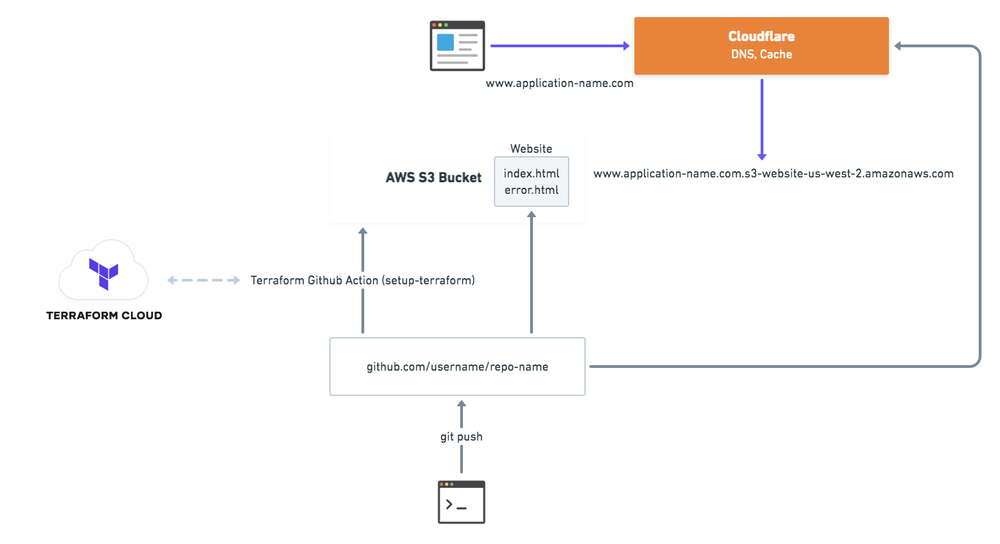

# Terraform Github Actions Demo

This repository contains Terraform configuration and Github Action workflow for [Collaborative application and infrastructure workflow using GitHub Actions and HashiCorp Terraform](https://githubsatellite.com/schedule/#collaborative-application-and-infrastructure-workflow-using-github-actions-and-hashicorp-terraform) talk at Github Satellite 2020.

## Overview



## Prerequisites

* HashiCorp [Terraform](https://terraform.io/downloads.html) installed. (version: > 0.12.x)
* AWS Account.
* Cloudflare Account.

### Optional

* [Terraform cloud](https://app.terraform.io/signup/account) account.

Terraform cloud can be used to store remote state. If you want to use the Terraform cloud remote state backend
you can uncomment the code in [remote.tf](./remote.tf) file.

You can generate a user api token using the guide: https://www.terraform.io/docs/cloud/users-teams-organizations/users.html#api-tokens

### Configure AWS authentication

```bash
export AWS_ACCESS_KEY_ID=""
export AWS_SECRET_ACCESS_KEY=""
```

### Configure Terraform variables

```bash
export TF_VAR_cloudflare_email="hello@example.com"
export TF_VAR_cloudflare_api_token="abcdxxxxxxxxxxxxxxxxxxxxxxxxxxxxxx"
export TF_VAR_cloudflare_zone_id="a1b2xxxxxxxxxxxxxxxxxxxxxxxxxxx"
```

## Usage

Clone the github repository

```bash
git clone https://github.com/anubhavmishra/terraform-github-actions-demo.git
```

Open the `terraform-github-actions-demo` directory.

```bash
cd terraform-github-actions-demo
```

Run Terraform init.

```bash
terraform init
```

Run Terraform plan.

```bash
terraform plan
```

Run Terraform apply.

```bash
terraform apply
```
